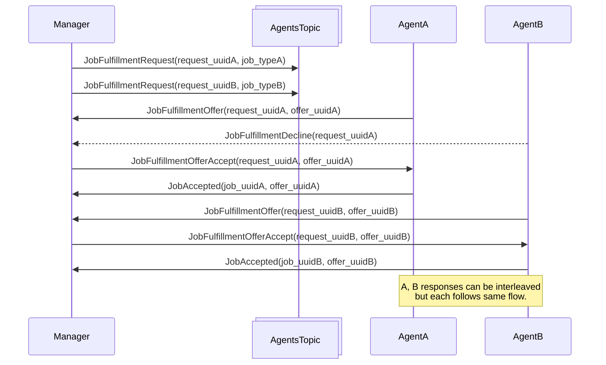
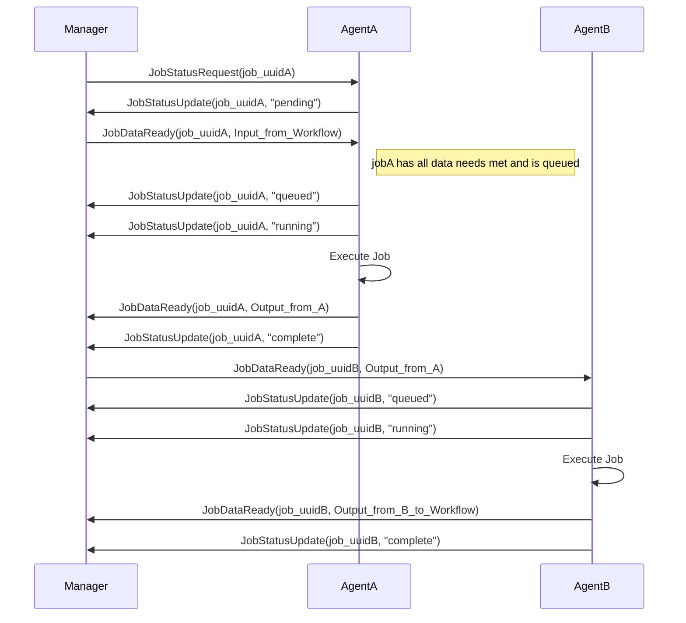

# caroni-demo
A docker based demo of the Caroni Workflow System

## Intro
Caroni is built with the follow tenants:

### Asynchronous
All communication is done via message passing.  This forces a blind eye to
network setups.  Additionally, implicit queueing means that if a host is
temporarily unavailable, "clients" are not hit with a "connection failed".

### Distributed
Possibly the wrong word, but there is no "head", "main", "control" node.  The
workflow managers simply indicate their needs; an agent is meant to serve as
many workflow managers as they (the agents) wish.

### Separation of concerns
As with above, the workflow managers indicate what they want.  However, agents
are in control of their own destiny; their concern is to see their resource
fully utilized.  If a job completes that came from workflow manager A, but the
next job doesn't have it's data transferred yet, the agent will service
something from workflow manager B.

For advanced use cases, an economy of sorts could emerge.

## Setup
Clone this repository if you haven't.
```bash
git clone https://github.com/shaunbrady/caroni-demo.git
cd caroni-demo
```

Create a shared network called caroni_shared_net
```bash
docker network create caroni_shared_net
```

Instantiate the Workflow manager, and then an agent
```bash
docker compose -f "wf-docker-compose.yaml" up
docker compose -f "agent-docker-compose.yaml" up
```

Included fixtures will create workflow templates, Job types, as well as
admin:password logins for the various web management interfaces. These fixtures
are ran automatically by the web management instances.

Log in to watch the services create objects, and manage their state.
```bash
http://127.0.0.1:8000/admin for the workflow manager (Watch Workflows/Steps/Dataflows)
http://127.0.0.1:8001/admin for the agent (Watch Jobs/Job Inputs/Job Outputs)
```

> **_NOTE:_**  Because the domains are the same, some browsers hiccup and force re-login as one bounced between the hosts. I'll fix this shortly.

Finally, fire off a job. Log in to the site-stub container, and execute a python
script that simulates a website or other actor requesting that the workflow
manager fire off a job of a given type.

Enter the sitestub container:
```base
docker compose -f wf-docker-compose.yaml exec sitestub bash
```
At the prompt, similar to `root@8c44404ce4f8:/app#`
type:
```bash
python site_stub.py caronirocks
```

With in moments (likely seconds), you'll be able to inspect the Workflow reach
the completed state in the workflows manager, and have "prepended
CARONIROCKSappend" in it's output.  Repeat the above command with your own
string, and observe the jobs manipulate it and ultimately return that to the
workflow manager.

### Optional setup of second agent
To demonstrate workflows spanning multiple agents, set up a second agent with:
```bash
docker compose -f "second-agent-docker-compose.yaml " up
```
The admin interface will be at:
```bash
http://127.0.0.1:8002/admin for the agent (Watch Jobs/Job Inputs/Job Outputs)
```

Delete complementing jobs in both agents (Ex: 1 & 3 on one agent, and 2 on the
other), and then run the workflow as normal.  Look at the Reply To in each
resultant job in the workflow manger (:8000).

### Optional induction of failure

To introduce a failure, in foojob2 (log in to the agent), replace the job text with
```bash
sleep 30; /usr/bin/jq -n --arg out "$(echo "$CARONI_ENV_final_text append")" 'X{out:$out}'
```

Notice the the capital X that makes the JSON invalid. This causes the job to
fail (and the manager thus retries).

The sleep 30 is to slow the execution of the jobs, and give you time to correct
the injected error (take the 'X' out). Watch for the agent to fail the first
round. Fix the error, and the save the job. Depending on your timing, the agent
may need to fail once more and then execute (when requested from the manager)
another version of the job with the error fixed. Eventually the workflow will
complete, having recovered.

There is a 5 limit of failed jobs (and related workflow steps) before the
workflow fails completely.

## Sequence diagrams
This diagram demonstrates the happy path of an workflow manager getting work
done on workflow agents.  It is broken into a few "phases" mostly for
readability.

This diagram shows a workflow of two jobs getting those jobs fulfilled.



This diagram shows how data flow from one job to another via the manager.


## Enjoy!
Caroni will be available as an open source project shortly. Feature requests and
PRs will be welcome!